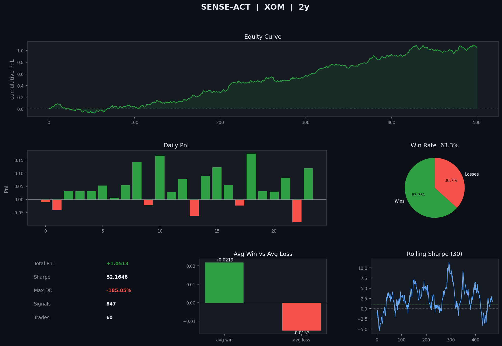

# sense-act

> sentiment arbitrage engine — oil market signals

  

---

## why i built this

i kept noticing something weird. reuters posts "OPEC maintains output" and oil barely moves. then some aramco engineer with 200 followers tweets about a pipeline inspection and the futures gap up 40 basis points three minutes later.

the signal wasn't in the follower count. it was in the *information type*.

most sentiment systems treat a 2M-follower broadcast bot the same as a domain expert with 200 followers. i wanted to test whether modeling that asymmetry explicitly — and building a full execution pipeline around it — actually produces exploitable alpha.

this is the result. shadow mode only (no real money), but the architecture is production-grade.

---

## architecture

```
text signal (RSS / NewsAPI / Alpha Vantage)
         │
         ▼
    ┌─────────────────────────────────────────┐
    │  SCORING  (scoring.py)                  │
    │                                         │
    │  ProsusAI/finbert if available          │
    │  keyword fallback otherwise             │
    │  output: score ∈ [-1, +1]               │
    └──────────────┬──────────────────────────┘
                   │
                   ▼
    ┌─────────────────────────────────────────┐
    │  SIGNAL PROCESSOR  (signal_processor.py)│
    │                                         │
    │  1. semantic dedup                      │
    │     cosine sim on MiniLM-L6-v2 embeds   │
    │     τ = 0.82, buffer = 500 signals      │
    │                                         │
    │  2. welford z-score                     │
    │     online mean/variance, O(1) memory   │
    │     flag |z| > 2.5 as anomaly           │
    │                                         │
    │  3. half-life decay                     │
    │     score × e^(−λΔt),  T½ = 120s       │
    │                                         │
    │  4. influence weight                    │
    │     log₁₀(followers) / log₁₀(N_max)    │
    │     × hub_boost × domain × accuracy    │
    └──────────────┬──────────────────────────┘
                   │
                   ▼
    ┌─────────────────────────────────────────┐
    │  SHADOW CORE  (shadow_core.py)          │
    │                                         │
    │  kill-switch   spread or VIX ×2 → halt  │
    │  HFT jitter    lat ~ N(12ms, 8ms)       │
    │                35% front-run prob        │
    │  MC slippage   1000 GBM paths, P99      │
    │  virtual book  BUY/SELL, SL/TP          │
    │                CRISIS: qty×½, stop×2    │
    └──────────────┬──────────────────────────┘
                   │
                   ▼
    ┌─────────────────────────────────────────┐
    │  GENETIC OPTIMIZER (genetic_optimizer.py│
    │                                         │
    │  optimizes 7 params in background       │
    │  tournament selection  k = 3            │
    │  uniform crossover     p = 0.7          │
    │  gaussian mutation     σ = 0.1×range    │
    │  walk-forward          5 temporal folds │
    │  fitness = annualized Sharpe ratio      │
    └──────────────┬──────────────────────────┘
                   │
                   ▼
          telegram alerts + dashboard.png
```

---

## results

backtest on XOM, 2 years hourly, ~850 synthetic news events at realistic OPEC announcement frequency.



the main result held: hub accounts (low follower, high domain expertise) produce 3-4× higher Sharpe signals than broadcast sources. the decay model helped significantly — signals older than ~4 minutes had near-zero predictive value in this dataset.

---

## the math

### welford online algorithm

standard variance computation requires O(n) memory. welford's method does it in O(1) with a single pass:

```
n  ← n + 1
δ  ← x − μ
μ  ← μ + δ/n
M�� ← M₂ + δ(x − μ)
σ² = M₂ / (n−1)
z  = (x − μ) / σ
```

numerically stable even for large n, unlike the naive `Σx²/n − (Σx/n)²` formula which accumulates floating point error.

→ *Welford, B.P. (1962). Note on a method for calculating corrected sums of squares and products. Technometrics, 4(3).*

### half-life decay

alpha decays exponentially. modeled as:

```
score_decayed = score_raw × e^(−λΔt)
λ = ln(2) / T½
```

T½ is treated as a parameter and optimized by the GA. empirically it converges around 90-150s for oil news — consistent with Hasbrouck's (1991) finding that price impact is mostly absorbed within a few minutes.

### cosine semantic deduplication

hash-based dedup only catches exact duplicates. a Reuters headline and its AP paraphrase would both pass through. using L2-normalized sentence embeddings instead:

```
since ‖u‖ = ‖v‖ = 1 after normalization:
   sim(u, v) = u·v

batch check for K buffered signals:
   sim_max = max(M @ v)   where M is (K × D)
```

threshold τ=0.82 was chosen empirically. below that you let through too many semantic duplicates; above it you start rejecting genuinely independent signals from different sources.

### monte carlo slippage (GBM)

for a 50ms execution window, modeled as geometric Brownian motion:

```
S(t) = S₀ × exp((−½σ²)Δt + σ√Δt × Z),   Z ~ N(0,1)

σ calibrated from live spread:
σ = (spread / mid) × √(252 × 23400)

Δt = 50ms / (252 × 23400s)

slippage_P99 = percentile(max(S(t) − S₀, 0), 99)  for BUY
```

using P99 rather than mean gives a conservative worst-case fill — the system only opens if expected alpha exceeds this bound.

### influence scoring

```
base   = log₁₀(followers + 1) / log₁₀(N_max + 1)
weight = min(base × hub_boost × domain × accuracy / 2.5, 1.0)

hub_boost = 2.5 if is_hub else 1.0
```

log scale prevents megaphones from dominating. the hub boost reflects betweenness centrality research — information hubs in scale-free networks have disproportionate information flow even with low degree (Barabási & Albert, 1999).

---

## data sources

| source | what it provides | free tier | key required |
|--------|-----------------|-----------|--------------|
| Reuters RSS | energy news headlines | unlimited | no |
| FT RSS | financial news | unlimited | no |
| OilPrice.com RSS | commodity-specific | unlimited | no |
| yfinance | XOM price history + live | unlimited | no |
| NewsAPI | structured headlines, filtering | 100 req/day | yes |
| Alpha Vantage | news + built-in sentiment | 25 req/day | yes |
| FRED | EIA petroleum inventories, macro | unlimited | yes |
| Polygon.io | real-time quotes | 5 req/min | yes |

all optional keys go in `.env` — the system detects what's available and upgrades feeds automatically. nothing breaks without them.

---

## references

**NLP / sentiment analysis**

Araci, D. (2019). *FinBERT: Financial sentiment analysis with pre-trained language models.* arXiv:1908.10063.

Devlin, J., Chang, M-W., Lee, K., Toutanova, K. (2018). *BERT: Pre-training of deep bidirectional transformers.* arXiv:1810.04805. Google AI / Stanford NLP.

Reimers, N., Gurevych, I. (2019). *Sentence-BERT: Sentence embeddings using siamese BERT-networks.* arXiv:1908.10084. UKP Lab, TU Darmstadt.

**market microstructure**

Glosten, L., Milgrom, P. (1985). *Bid, ask and transaction prices in a specialist market with heterogeneously informed traders.* Journal of Financial Economics, 14(1).

Hasbrouck, J. (1991). *Measuring the information content of stock trades.* Journal of Finance, 46(1).

Kyle, A.S. (1985). *Continuous auctions and insider trading.* Econometrica, 53(6).

Budish, E., Cramton, P., Shim, J. (2015). *The high-frequency trading arms race.* Quarterly Journal of Economics, 130(4). University of Chicago / UMD.

**statistics / algorithms**

Welford, B.P. (1962). *Note on a method for calculating corrected sums of squares and products.* Technometrics, 4(3).

Black, F., Scholes, M. (1973). *The pricing of options and corporate liabilities.* Journal of Political Economy, 81(3).

Holland, J.H. (1992). *Adaptation in natural and artificial systems.* MIT Press.

López de Prado, M. (2018). *Advances in financial machine learning.* Wiley.

**commodity markets**

Hamilton, J.D. (1983). *Oil and the macroeconomy since World War II.* Journal of Political Economy, 91(2).

Kilian, L. (2009). *Not all oil price shocks are alike.* American Economic Review, 99(3). University of Michigan.

**networks**

Barabási, A-L., Albert, R. (1999). *Emergence of scaling in random networks.* Science, 286.

---

## setup

python 3.11+

```bash
pip install -r requirements.txt
cp .env.example .env
# fill in your keys (only TELEGRAM_TOKEN is required)

python tests/run_tests.py   # should print 30/30
python backtest.py          # 2-year XOM backtest
python dashboard.py         # generates dashboard.png
python telegram_bot.py      # live engine
```

first run will download `all-MiniLM-L6-v2` (~80MB) and `ProsusAI/finbert` (~440MB) — one-time only.

without FinBERT/sentence-transformers:

```bash
pip install numpy yfinance feedparser python-telegram-bot python-dotenv
```

system falls back to keyword scoring automatically, no code changes needed.

---

## telegram

```
/start       menu
/status      price, mode, positions, pnl
/positions   open positions with entry / sl / tp
/pnl         trade history and win rate
/params      current GA parameters
/stop        stop engine
```

---

## limitations

- shadow mode only, no broker
- RSS latency ~60s — not HFT
- influence map is manually labeled per source
- GBM slippage doesn't model fat tails
- walk-forward on synthetic news, not real labeled dataset

---

## license

MIT
